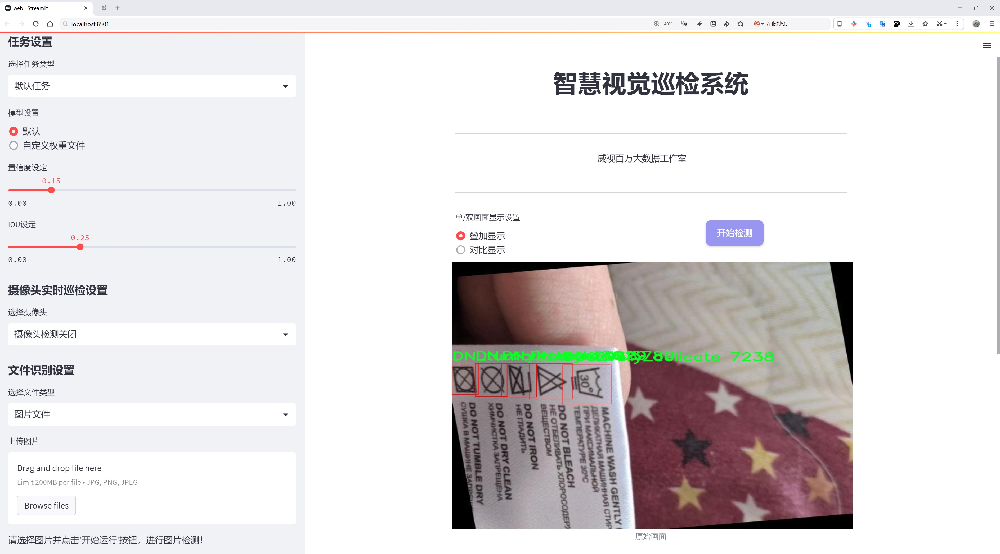
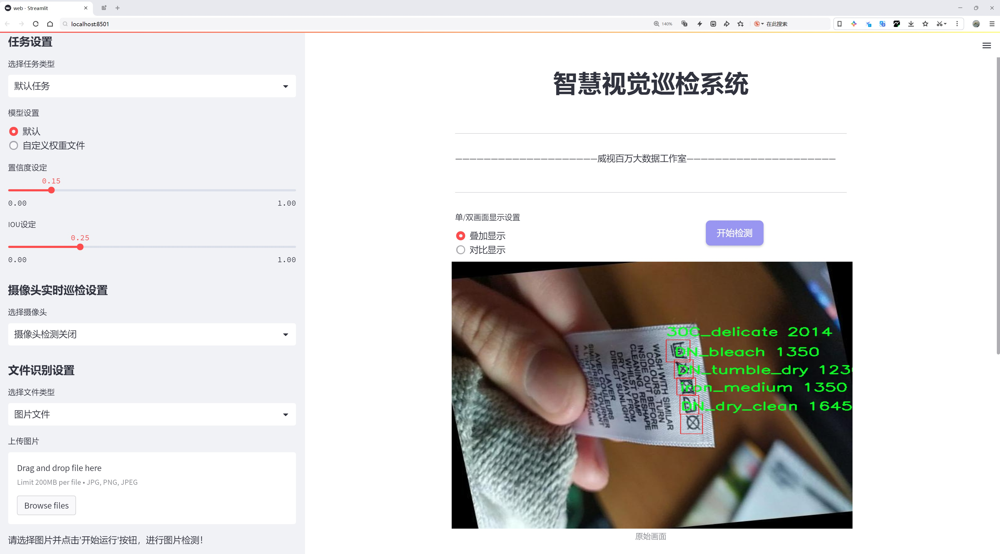
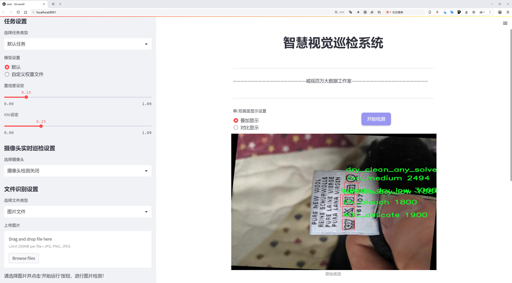
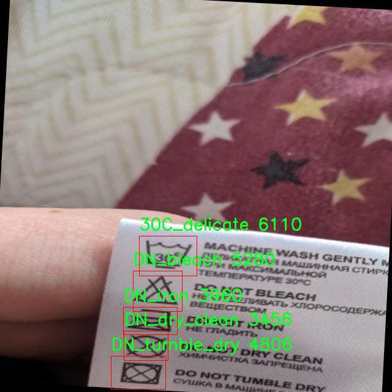
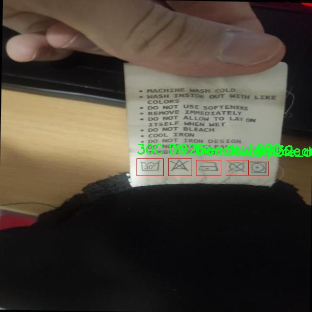
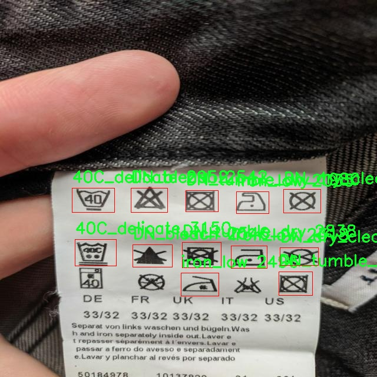
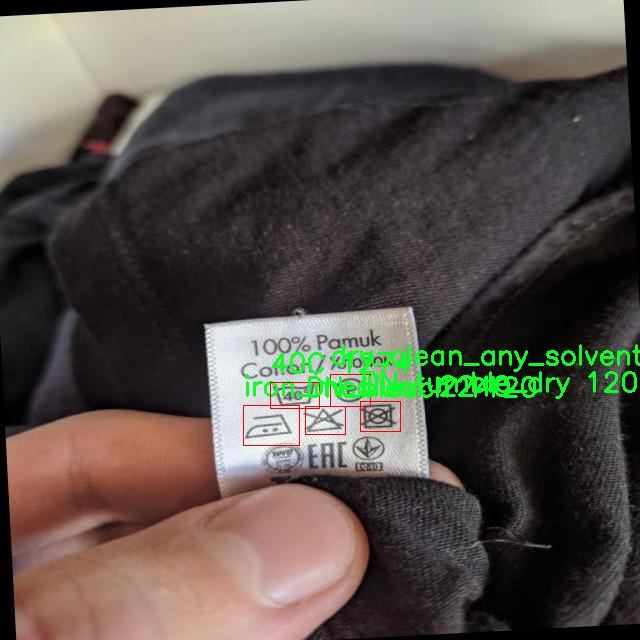
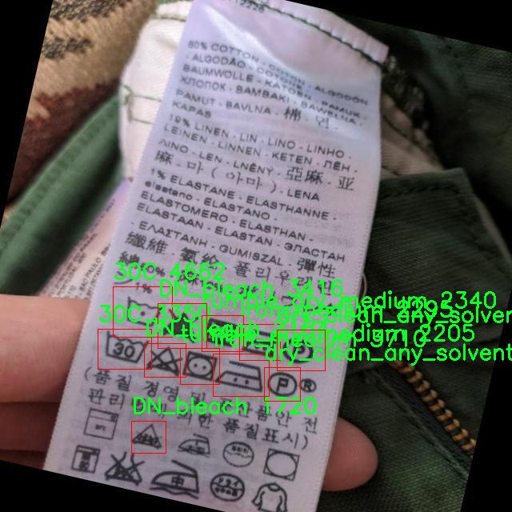

# 洗涤标签类型检测检测系统源码分享
 # [一条龙教学YOLOV8标注好的数据集一键训练_70+全套改进创新点发刊_Web前端展示]

### 1.研究背景与意义

项目参考[AAAI Association for the Advancement of Artificial Intelligence](https://gitee.com/qunmasj/projects)

项目来源[AACV Association for the Advancement of Computer Vision](https://github.com/qunshansj/good)

研究背景与意义

随着全球经济的发展和人们生活水平的提高，服装行业的快速发展使得洗涤标签的使用变得愈加普遍。洗涤标签不仅为消费者提供了重要的洗护信息，还在一定程度上影响了服装的使用寿命和外观保持。因此，准确识别和解读洗涤标签的类型，对于提高服装的护理质量、延长其使用寿命具有重要意义。然而，传统的洗涤标签识别方法多依赖人工解读，效率低下且容易出错，尤其是在面对多样化的标签样式和复杂的洗护信息时，人工识别的局限性愈加明显。

近年来，深度学习技术的迅猛发展为图像识别领域带来了新的机遇，尤其是目标检测算法的进步，使得计算机能够在图像中快速、准确地识别和分类对象。YOLO（You Only Look Once）系列模型因其高效的实时检测能力而受到广泛关注。YOLOv8作为该系列的最新版本，结合了更为先进的特征提取和检测算法，具备了更高的准确性和更快的处理速度。然而，针对洗涤标签类型的检测，现有的YOLOv8模型尚未经过专门的优化，难以充分应对洗涤标签的多样性和复杂性。

本研究旨在基于改进的YOLOv8模型，构建一个高效的洗涤标签类型检测系统。为此，我们使用了包含3122张图像和18个类别的洗涤标签数据集，涵盖了从30C到干洗等多种洗护指示。通过对该数据集的深入分析，我们可以提取出不同洗涤标签的特征，并利用改进的YOLOv8模型进行训练和优化，从而实现对洗涤标签的高效识别与分类。

该研究的意义不仅在于推动洗涤标签识别技术的发展，更在于为消费者提供更为便捷的洗护信息获取方式。通过自动化的洗涤标签检测系统，消费者可以快速了解衣物的洗护要求，避免因错误洗护而导致的衣物损坏。此外，该系统还可以为服装生产企业提供数据支持，帮助其优化产品设计和标签制作，从而提升消费者的满意度和品牌形象。

总之，基于改进YOLOv8的洗涤标签类型检测系统的研究，不仅具有重要的理论价值，还具有广泛的应用前景。通过这一研究，我们希望能够为洗涤标签的智能识别提供新的解决方案，推动服装行业的智能化发展，最终实现更高效、更环保的洗护方式。

### 2.图片演示







##### 注意：由于此博客编辑较早，上面“2.图片演示”和“3.视频演示”展示的系统图片或者视频可能为老版本，新版本在老版本的基础上升级如下：（实际效果以升级的新版本为准）

  （1）适配了YOLOV8的“目标检测”模型和“实例分割”模型，通过加载相应的权重（.pt）文件即可自适应加载模型。

  （2）支持“图片识别”、“视频识别”、“摄像头实时识别”三种识别模式。

  （3）支持“图片识别”、“视频识别”、“摄像头实时识别”三种识别结果保存导出，解决手动导出（容易卡顿出现爆内存）存在的问题，识别完自动保存结果并导出到tempDir中。

  （4）支持Web前端系统中的标题、背景图等自定义修改，后面提供修改教程。

  另外本项目提供训练的数据集和训练教程,暂不提供权重文件（best.pt）,需要您按照教程进行训练后实现图片演示和Web前端界面演示的效果。

### 3.视频演示

[3.1 视频演示](https://www.bilibili.com/video/BV1AFH5edEKQ/?vd_source=ff015de2d29cbe2a9cdbfa7064407a08)

### 4.数据集信息展示

数据集信息展示

在本研究中，我们使用名为“part8”的数据集来训练和改进YOLOv8模型，以实现对洗涤标签类型的精准检测。该数据集包含18个不同的类别，涵盖了洗涤标签上常见的各种洗涤指示。这些类别的多样性反映了现代洗涤标签所传达的信息的复杂性，旨在帮助消费者正确理解衣物的洗涤和护理要求，从而延长衣物的使用寿命并保持其外观。

“part8”数据集的类别包括：30C、30C_delicate、30C_very_delicate、40C、40C_delicate、DN_bleach、DN_dry_clean、DN_iron、DN_tumble_dry、DN_wash、bleach_non_chlorine、dry_clean_any_solvent_except_trichloroethylene、hand_wash、iron_high、iron_low、iron_medium、tumble_dry_low和tumble_dry_medium。这些类别不仅涵盖了不同温度下的洗涤指示（如30C和40C），还细分了洗涤过程中的各种特殊要求，例如“delicate”和“very_delicate”指示，旨在指导用户如何在清洗过程中采取额外的保护措施。

此外，数据集中还包括多种干洗和熨烫的指示，如“DN_dry_clean”和“iron_high”，这些信息对于那些需要特殊护理的衣物尤为重要。通过这些类别的设置，数据集能够提供丰富的样本，以便模型学习和识别不同洗涤标签的特征。值得注意的是，数据集中的“DN_tumble_dry”和“DN_wash”类别，分别指示了可进行的干燥和洗涤方式，进一步增强了模型在实际应用中的实用性。

在数据集的构建过程中，研究团队确保每个类别都包含足够的样本，以提高模型的泛化能力和准确性。数据集中的样本不仅包括不同品牌和材质的洗涤标签，还涵盖了多种语言的标签信息，确保模型能够适应全球市场的需求。这种多样性使得“part8”数据集在训练过程中能够有效捕捉到不同标签的特征，从而提升YOLOv8模型在实际应用中的表现。

通过对“part8”数据集的深入分析，我们可以发现，洗涤标签的种类和信息的丰富性不仅为消费者提供了重要的洗护指导，也为机器学习模型的训练提供了良好的基础。模型在经过充分的训练后，能够自动识别和分类这些洗涤标签，从而为用户提供实时的洗护建议，极大地提升了用户体验。

总之，“part8”数据集为我们改进YOLOv8的洗涤标签类型检测系统提供了坚实的基础，涵盖了广泛的类别和多样的样本，使得模型在实际应用中能够更好地满足用户的需求。通过对这一数据集的充分利用，我们期待能够在洗涤标签的自动识别领域取得显著的进展，为智能洗护系统的发展贡献力量。











### 5.全套项目环境部署视频教程（零基础手把手教学）

[5.1 环境部署教程链接（零基础手把手教学）](https://www.ixigua.com/7404473917358506534?logTag=c807d0cbc21c0ef59de5)


[5.2 安装Python虚拟环境创建和依赖库安装视频教程链接（零基础手把手教学）](https://www.ixigua.com/7404474678003106304?logTag=1f1041108cd1f708b01a)

### 6.手把手YOLOV8训练视频教程（零基础小白有手就能学会）

[6.1 环境部署教程链接（零基础手把手教学）](https://www.ixigua.com/7404477157818401292?logTag=d31a2dfd1983c9668658)

### 7.70+种全套YOLOV8创新点代码加载调参视频教程（一键加载写好的改进模型的配置文件）

[7.1 环境部署教程链接（零基础手把手教学）](https://www.ixigua.com/7404478314661806627?logTag=29066f8288e3f4eea3a4)

### 8.70+种全套YOLOV8创新点原理讲解（非科班也可以轻松写刊发刊，V10版本正在科研待更新）

由于篇幅限制，每个创新点的具体原理讲解就不一一展开，具体见下列网址中的创新点对应子项目的技术原理博客网址【Blog】：


[8.1 70+种全套YOLOV8创新点原理讲解链接](https://gitee.com/qunmasj/good)

### 9.系统功能展示（检测对象为举例，实际内容以本项目数据集为准）

图9.1.系统支持检测结果表格显示

  图9.2.系统支持置信度和IOU阈值手动调节

  图9.3.系统支持自定义加载权重文件best.pt(需要你通过步骤5中训练获得)

  图9.4.系统支持摄像头实时识别

  图9.5.系统支持图片识别

  图9.6.系统支持视频识别

  图9.7.系统支持识别结果文件自动保存

  图9.8.系统支持Excel导出检测结果数据


### 10.原始YOLOV8算法原理

原始YOLOv8算法原理

YOLOv8算法是目标检测领域的一项重要进展，它在YOLOv5的基础上进行了多方面的优化和改进，旨在提高检测精度和速度，同时保持模型的轻量化特性。YOLOv8的网络结构主要由三个部分组成：骨干特征提取网络、特征融合层和检测头层。这种设计使得YOLOv8能够有效地处理各种复杂的目标检测任务。

在骨干特征提取网络层，YOLOv8采用了C2F模块来替代原有的C3模块。C2F模块通过引入ELAN（Efficient Layer Aggregation Network）思想，优化了特征提取过程。具体来说，C2F模块由多个CBS（Convolution + Batch Normalization + SiLU）模块和若干个Bottleneck网络组成。这样的设计使得网络能够在保持特征图尺寸一致的情况下，增加特征的丰富性和梯度流动性，从而缓解深层网络中的梯度消失问题。C2F模块的两个分支结构使得特征能够更有效地被重用，并且通过多次的shortcut连接，进一步提升了模型的学习能力。

特征融合层则是YOLOv8的另一大亮点。它结合了特征金字塔网络（FPN）和路径聚合网络（PAN），通过双向跨尺度连接和加权特征融合的方式，提高了模型对不同尺度特征信息的提取速度和准确性。YOLOv8引入了BiFPN（Bidirectional Feature Pyramid Network）结构，能够在特征融合过程中高效地进行信息的交互与整合。这种结构不仅提升了特征的多样性，还增强了模型对小目标的检测能力，使得YOLOv8在处理复杂场景时表现得更加出色。

在检测头层，YOLOv8采用了解耦头的设计，取代了传统的耦合头。这种解耦设计使得分类和回归任务能够独立进行，从而提高了模型的灵活性和准确性。此外，YOLOv8采用了无锚（Anchor-Free）目标检测的理念，摒弃了以往依赖于锚框的方式，使得模型在处理目标时更加高效。通过引入VFLLoss和DFLLoss+CIoULoss作为损失函数，YOLOv8能够更好地应对样本不平衡和困难样本问题，进一步提升了检测性能。

在数据预处理方面，YOLOv8延续了YOLOv5的策略，采用了多种数据增强手段，如马赛克增强、混合增强、空间扰动和颜色扰动等。这些增强手段能够有效提高模型的泛化能力，使得YOLOv8在面对不同场景和条件时依然能够保持良好的检测效果。

YOLOv8的输入层负责将输入图像转换为640x640的RGB图像，随后经过CBS网络进行特征提取。CBS网络的设计通过卷积层提取目标的纹理和颜色信息，同时利用归一化技术解决反向传播过程中的梯度消失和梯度爆炸问题。SiLU激活函数的引入则进一步提升了网络的非线性变换能力，使得模型在特征学习过程中更加高效。

在YOLOv8的Neck结构中，PAFPN（Path Aggregation Feature Pyramid Network）被用来构建特征金字塔，充分融合多尺度信息。该结构通过自下而上的融合过程，将高层特征与中层和浅层特征进行有效结合，从而提升了目标检测的准确性。通过将不同层次的特征进行横向连接，YOLOv8能够确保每一层都具有适当的分辨率和高层语义特征，进而实现对各种目标的准确检测。

最后，YOLOv8的Head结构通过输出多个尺度的特征图，实现了对目标的分类和边框回归。其分类预测分支和边框预测分支采用了不同的损失函数进行优化，使得模型在处理复杂场景时能够保持高效的检测能力。通过将输出的特征图进行拼接和维度变换，YOLOv8能够在不同尺度上进行目标检测，确保对小目标和大目标的均衡处理。

综上所述，YOLOv8算法通过多层次的优化和创新设计，成功地提升了目标检测的性能。其轻量化的结构和高效的特征提取、融合机制，使得YOLOv8在实际应用中表现出色，成为目标检测领域的一项重要技术。


### 11.项目核心源码讲解（再也不用担心看不懂代码逻辑）

#### 11.1 ultralytics\models\nas\val.py

以下是经过精简和注释的核心代码部分：

```python
# 导入必要的库
import torch
from ultralytics.utils import ops

class NASValidator:
    """
    Ultralytics YOLO NAS 验证器，用于目标检测。

    该类用于对 YOLO NAS 模型生成的原始预测结果进行后处理。它执行非极大值抑制（NMS），
    以去除重叠和低置信度的框，最终生成最终检测结果。
    """

    def __init__(self, args):
        """
        初始化 NASValidator。

        参数:
            args (Namespace): 包含后处理配置的命名空间，例如置信度和 IoU 阈值。
        """
        self.args = args  # 保存后处理配置

    def postprocess(self, preds_in):
        """对预测输出应用非极大值抑制（NMS）。"""
        # 将预测框从 xyxy 格式转换为 xywh 格式
        boxes = ops.xyxy2xywh(preds_in[0][0])
        
        # 将框和置信度合并，并调整维度
        preds = torch.cat((boxes, preds_in[0][1]), -1).permute(0, 2, 1)
        
        # 应用非极大值抑制，返回最终检测结果
        return ops.non_max_suppression(
            preds,
            self.args.conf,  # 置信度阈值
            self.args.iou,   # IoU 阈值
            labels=None,     # 可选的多标签 NMS
            multi_label=False,  # 是否使用多标签
            agnostic=self.args.single_cls,  # 是否单类检测
            max_det=self.args.max_det,  # 最大检测框数量
            max_time_img=0.5,  # 每张图像的最大处理时间
        )
```

### 代码注释说明：
1. **导入库**：导入 `torch` 和 `ops`，后者用于执行一些操作，如坐标转换和非极大值抑制。
2. **类定义**：`NASValidator` 类用于处理 YOLO NAS 模型的预测结果。
3. **初始化方法**：构造函数接收一个参数 `args`，用于存储后处理所需的配置（如置信度和 IoU 阈值）。
4. **postprocess 方法**：该方法对输入的预测结果进行后处理，主要步骤包括：
   - 将预测框从 `xyxy` 格式转换为 `xywh` 格式。
   - 合并框和置信度，并调整维度以适应后续处理。
   - 调用 `non_max_suppression` 方法，应用非极大值抑制，去除重叠和低置信度的框，返回最终的检测结果。

这个文件是Ultralytics YOLO模型中的一个验证器类，主要用于处理YOLO NAS（Neural Architecture Search）模型的目标检测结果。文件中首先导入了必要的库，包括PyTorch和Ultralytics模型中的检测验证器。然后定义了一个名为`NASValidator`的类，它继承自`DetectionValidator`类，专门用于对YOLO NAS模型生成的原始预测结果进行后处理。

`NASValidator`类的主要功能是执行非极大值抑制（Non-Maximum Suppression, NMS），以去除重叠和低置信度的边界框，从而最终生成最终的检测结果。类中包含了一些属性，例如`args`，它是一个命名空间，包含了后处理所需的各种配置，如置信度和IoU（Intersection over Union）阈值；`lb`是一个可选的张量，用于多标签NMS。

在类的文档字符串中，给出了一个使用示例，展示了如何使用`NASValidator`进行后处理。通常情况下，这个类不会被直接实例化，而是在`NAS`类内部使用。

`postprocess`方法是`NASValidator`类的核心功能之一，它接收原始预测结果作为输入，并应用非极大值抑制。首先，它将输入的预测框坐标从xyxy格式转换为xywh格式，然后将框坐标与置信度合并，最后调用`ops.non_max_suppression`方法进行非极大值抑制，返回最终的检测结果。该方法还接受一些参数，如置信度阈值、IoU阈值、标签、是否使用多标签等，确保后处理的灵活性和准确性。

总的来说，这个文件的主要目的是提供一个有效的工具，用于处理YOLO NAS模型的输出，确保检测结果的准确性和可靠性。

#### 11.2 ultralytics\utils\callbacks\clearml.py

以下是代码中最核心的部分，并附上详细的中文注释：

```python
# 导入必要的库
from ultralytics.utils import LOGGER, SETTINGS, TESTS_RUNNING

# 尝试导入 ClearML 库并进行一些基本的检查
try:
    assert not TESTS_RUNNING  # 确保当前不是在运行测试
    assert SETTINGS["clearml"] is True  # 确保 ClearML 集成已启用
    import clearml
    from clearml import Task  # 导入 ClearML 的 Task 类

    # 确保 ClearML 版本可用
    assert hasattr(clearml, "__version__")  

except (ImportError, AssertionError):
    clearml = None  # 如果导入失败，则将 clearml 设置为 None

def on_pretrain_routine_start(trainer):
    """在预训练例程开始时运行；初始化并连接/记录任务到 ClearML。"""
    try:
        task = Task.current_task()  # 获取当前任务
        if task:
            # 禁用自动的 PyTorch 和 Matplotlib 绑定
            PatchPyTorchModelIO.update_current_task(None)
            PatchedMatplotlib.update_current_task(None)
        else:
            # 初始化新的 ClearML 任务
            task = Task.init(
                project_name=trainer.args.project or "YOLOv8",  # 项目名称
                task_name=trainer.args.name,  # 任务名称
                tags=["YOLOv8"],  # 标签
                output_uri=True,
                reuse_last_task_id=False,
                auto_connect_frameworks={"pytorch": False, "matplotlib": False},  # 禁用自动连接
            )
            LOGGER.warning(
                "ClearML Initialized a new task. If you want to run remotely, "
                "please add clearml-init and connect your arguments before initializing YOLO."
            )
        task.connect(vars(trainer.args), name="General")  # 连接训练参数
    except Exception as e:
        LOGGER.warning(f"WARNING ⚠️ ClearML installed but not initialized correctly, not logging this run. {e}")

def on_train_epoch_end(trainer):
    """在 YOLO 训练的每个 epoch 结束时记录调试样本并报告当前训练进度。"""
    task = Task.current_task()  # 获取当前任务
    if task:
        # 记录调试样本
        if trainer.epoch == 1:
            _log_debug_samples(sorted(trainer.save_dir.glob("train_batch*.jpg")), "Mosaic")
        # 报告当前训练进度
        for k, v in trainer.label_loss_items(trainer.tloss, prefix="train").items():
            task.get_logger().report_scalar("train", k, v, iteration=trainer.epoch)  # 记录训练损失
        for k, v in trainer.lr.items():
            task.get_logger().report_scalar("lr", k, v, iteration=trainer.epoch)  # 记录学习率

def on_train_end(trainer):
    """在训练完成时记录最终模型及其名称。"""
    task = Task.current_task()  # 获取当前任务
    if task:
        # 记录最终结果，包括混淆矩阵和 PR 曲线
        files = [
            "results.png",
            "confusion_matrix.png",
            "confusion_matrix_normalized.png",
            *(f"{x}_curve.png" for x in ("F1", "PR", "P", "R")),
        ]
        files = [(trainer.save_dir / f) for f in files if (trainer.save_dir / f).exists()]  # 过滤存在的文件
        for f in files:
            _log_plot(title=f.stem, plot_path=f)  # 记录图像
        # 报告最终指标
        for k, v in trainer.validator.metrics.results_dict.items():
            task.get_logger().report_single_value(k, v)  # 记录指标
        # 记录最终模型
        task.update_output_model(model_path=str(trainer.best), model_name=trainer.args.name, auto_delete_file=False)

# 定义回调函数
callbacks = (
    {
        "on_pretrain_routine_start": on_pretrain_routine_start,
        "on_train_epoch_end": on_train_epoch_end,
        "on_train_end": on_train_end,
    }
    if clearml
    else {}
)
```

### 代码核心部分解释：
1. **ClearML集成**：代码首先尝试导入ClearML库，并确保其正确配置。ClearML用于记录实验和训练过程中的信息。
2. **任务初始化**：在`on_pretrain_routine_start`函数中，代码会初始化一个ClearML任务，连接训练参数，并禁用自动绑定，以便手动记录信息。
3. **训练过程记录**：在每个训练epoch结束时，`on_train_epoch_end`函数会记录训练损失和学习率等信息。
4. **训练结束记录**：在训练结束时，`on_train_end`函数会记录最终的模型、混淆矩阵、PR曲线等信息，并将其上传到ClearML。

这个程序文件 `clearml.py` 是 Ultralytics YOLO 项目的一部分，主要用于集成 ClearML，这是一个用于机器学习实验管理的工具。该文件的功能是通过 ClearML 记录和可视化训练过程中的各种信息。

首先，文件导入了一些必要的模块和库，包括日志记录器 `LOGGER`、设置 `SETTINGS` 和测试状态 `TESTS_RUNNING`。在尝试导入 ClearML 库时，程序会检查是否在运行测试，以及 ClearML 集成是否启用。如果导入失败或条件不满足，`clearml` 将被设置为 `None`。

接下来，定义了几个函数来处理不同的日志记录任务。`_log_debug_samples` 函数用于将图像文件作为调试样本记录到 ClearML 任务中。它接受文件路径列表和标题作为参数，并在当前任务中记录这些图像。`_log_plot` 函数则用于将图像作为绘图记录，显示在 ClearML 的绘图部分。

文件中还定义了一些回调函数，这些函数在训练过程的不同阶段被调用。`on_pretrain_routine_start` 函数在预训练例程开始时运行，初始化并连接到 ClearML 任务。如果当前没有任务，它会创建一个新任务并记录相关信息。`on_train_epoch_end` 函数在每个训练周期结束时被调用，记录调试样本并报告当前的训练进度。`on_fit_epoch_end` 函数在每个周期结束时报告模型信息。`on_val_end` 函数用于记录验证结果，包括标签和预测。最后，`on_train_end` 函数在训练完成时记录最终模型及其名称，并报告最终的性能指标。

最后，文件将这些回调函数组织成一个字典 `callbacks`，如果 ClearML 可用，则将这些函数与相应的事件关联起来，以便在训练过程中自动调用。这个设计使得训练过程中的信息记录变得更加系统化和自动化，方便后续的分析和可视化。

#### 11.3 ui.py

```python
import sys
import subprocess

def run_script(script_path):
    """
    使用当前 Python 环境运行指定的脚本。

    Args:
        script_path (str): 要运行的脚本路径

    Returns:
        None
    """
    # 获取当前 Python 解释器的路径
    python_path = sys.executable

    # 构建运行命令
    command = f'"{python_path}" -m streamlit run "{script_path}"'

    # 执行命令
    result = subprocess.run(command, shell=True)
    if result.returncode != 0:
        print("脚本运行出错。")


# 实例化并运行应用
if __name__ == "__main__":
    # 指定您的脚本路径
    script_path = "web.py"  # 这里直接指定脚本路径

    # 运行脚本
    run_script(script_path)
```

### 代码核心部分及详细注释

1. **导入必要的模块**：
   - `sys`: 用于访问与 Python 解释器相关的变量和函数。
   - `subprocess`: 用于创建新进程、连接到它们的输入/输出/错误管道，并获得返回码。

2. **定义 `run_script` 函数**：
   - 该函数接收一个参数 `script_path`，表示要运行的 Python 脚本的路径。
   - 函数内部首先获取当前 Python 解释器的路径，确保使用正确的 Python 环境来运行脚本。

3. **构建运行命令**：
   - 使用格式化字符串构建命令，命令的形式为：`"{python_path}" -m streamlit run "{script_path}"`，这表示使用当前 Python 解释器来运行 `streamlit` 模块，并执行指定的脚本。

4. **执行命令**：
   - 使用 `subprocess.run` 方法执行构建的命令。`shell=True` 允许在 shell 中执行命令。
   - 检查命令的返回码，如果返回码不为 0，表示脚本运行出错，打印错误信息。

5. **主程序入口**：
   - 使用 `if __name__ == "__main__":` 确保只有在直接运行该脚本时才会执行以下代码。
   - 指定要运行的脚本路径（在这里是 `web.py`）。
   - 调用 `run_script` 函数来运行指定的脚本。

这个程序文件名为 `ui.py`，其主要功能是通过当前的 Python 环境运行一个指定的脚本，具体来说是运行一个名为 `web.py` 的脚本。程序首先导入了必要的模块，包括 `sys`、`os` 和 `subprocess`，以及一个自定义的 `abs_path` 函数，这个函数可能用于获取脚本的绝对路径。

在 `run_script` 函数中，首先获取当前 Python 解释器的路径，这通过 `sys.executable` 实现。接着，构建一个命令字符串，该命令使用 `streamlit` 来运行指定的脚本。`streamlit` 是一个用于构建数据应用的框架，因此这里的脚本 `web.py` 可能是一个基于 `streamlit` 的应用。

然后，使用 `subprocess.run` 方法执行构建好的命令。这个方法会在一个新的 shell 中运行命令，并等待其完成。如果命令执行的返回码不为 0，表示脚本运行出错，程序会打印出相应的错误信息。

在文件的最后部分，使用 `if __name__ == "__main__":` 语句来确保只有在直接运行该文件时才会执行后面的代码。在这里，指定了要运行的脚本路径 `web.py`，并调用 `run_script` 函数来执行它。

总的来说，这个程序的作用是简化在命令行中运行 `streamlit` 应用的过程，通过 Python 脚本自动化执行。

#### 11.4 train.py

以下是代码中最核心的部分，并附上详细的中文注释：

```python
import os
import torch
import yaml
from ultralytics import YOLO  # 导入YOLO模型
from QtFusion.path import abs_path  # 导入路径处理工具

# 确定使用的设备，如果有可用的GPU则使用GPU，否则使用CPU
device = "0" if torch.cuda.is_available() else "cpu"

if __name__ == '__main__':  # 确保该模块被直接运行时才执行以下代码
    workers = 1  # 设置数据加载的工作进程数
    batch = 2  # 设置每个批次的大小

    data_name = "data"  # 数据集名称
    # 获取数据集的yaml配置文件的绝对路径
    data_path = abs_path(f'datasets/{data_name}/{data_name}.yaml', path_type='current')  
    unix_style_path = data_path.replace(os.sep, '/')  # 将路径转换为Unix风格

    # 获取数据集目录的路径
    directory_path = os.path.dirname(unix_style_path)
    
    # 读取YAML文件，保持原有顺序
    with open(data_path, 'r') as file:
        data = yaml.load(file, Loader=yaml.FullLoader)
    
    # 如果YAML文件中有'path'项，则修改为当前目录路径
    if 'path' in data:
        data['path'] = directory_path
        # 将修改后的数据写回YAML文件
        with open(data_path, 'w') as file:
            yaml.safe_dump(data, file, sort_keys=False)

    # 加载预训练的YOLOv8模型
    model = YOLO(model='./ultralytics/cfg/models/v8/yolov8s.yaml', task='detect')  
    
    # 开始训练模型
    results2 = model.train(  
        data=data_path,  # 指定训练数据的配置文件路径
        device=device,  # 指定使用的设备
        workers=workers,  # 指定使用的工作进程数
        imgsz=640,  # 指定输入图像的大小为640x640
        epochs=100,  # 指定训练的轮数为100
        batch=batch,  # 指定每个批次的大小
        name='train_v8_' + data_name  # 指定训练任务的名称
    )
```

### 代码注释说明：
1. **导入库**：导入必要的库，包括操作系统处理、PyTorch、YAML解析和YOLO模型。
2. **设备选择**：根据是否有可用的GPU来选择训练设备。
3. **主程序入口**：确保代码在直接运行时执行。
4. **数据集路径处理**：获取数据集的配置文件路径，并将其转换为Unix风格的路径。
5. **读取和修改YAML文件**：读取数据集的YAML配置文件，修改其中的路径项为当前目录，并将修改后的内容写回文件。
6. **模型加载**：加载YOLOv8的预训练模型，准备进行训练。
7. **模型训练**：调用模型的训练方法，传入必要的参数，如数据路径、设备、工作进程数、图像大小、训练轮数和批次大小等。

这个程序文件`train.py`主要用于训练YOLOv8目标检测模型。首先，程序导入了必要的库，包括`os`、`torch`、`yaml`和`ultralytics`中的YOLO模型。根据系统是否支持CUDA，程序会选择使用GPU（设备编号为"0"）或CPU进行训练。

在`__main__`块中，程序首先设置了一些训练参数，如工作进程数`workers`和批次大小`batch`。接着，定义了数据集的名称`data_name`，并构建了数据集配置文件的绝对路径。程序使用`abs_path`函数来获取数据集的路径，并将路径中的分隔符统一为Unix风格。

随后，程序获取数据集配置文件所在的目录路径，并打开该YAML文件以读取数据。读取后，程序检查YAML文件中是否包含`path`项，如果有，则将其修改为数据集的目录路径，并将更新后的内容写回到YAML文件中，以确保模型能够正确找到数据集。

接下来，程序加载了YOLOv8的预训练模型，指定了模型的配置文件路径。然后，调用`model.train()`方法开始训练模型。在训练过程中，程序指定了训练数据的配置文件路径、使用的设备、工作进程数、输入图像的大小（640x640）、训练的轮数（100个epoch）、每个批次的大小（2），以及训练任务的名称。

整体来看，这段代码实现了YOLOv8模型的训练流程，包括数据集路径的处理、模型的加载以及训练参数的设置。

#### 11.5 ultralytics\hub\__init__.py

以下是经过简化和注释的核心代码部分：

```python
# 导入必要的库
import requests
from ultralytics.hub.auth import Auth
from ultralytics.utils import LOGGER, SETTINGS

def login(api_key: str = None, save=True) -> bool:
    """
    使用提供的API密钥登录Ultralytics HUB API。

    参数:
        api_key (str, optional): 用于身份验证的API密钥。如果未提供，将从SETTINGS或HUB_API_KEY环境变量中获取。
        save (bool, optional): 如果身份验证成功，是否将API密钥保存到SETTINGS中。
    
    返回:
        bool: 如果身份验证成功则返回True，否则返回False。
    """
    # 检查所需的库版本
    checks.check_requirements("hub-sdk>=0.0.2")
    from hub_sdk import HUBClient

    # 设置API密钥的URL
    api_key_url = f"{HUB_WEB_ROOT}/settings?tab=api+keys"
    saved_key = SETTINGS.get("api_key")  # 从设置中获取已保存的API密钥
    active_key = api_key or saved_key  # 如果提供了api_key，则使用它，否则使用已保存的密钥
    credentials = {"api_key": active_key} if active_key else None  # 设置凭据

    client = HUBClient(credentials)  # 初始化HUBClient

    if client.authenticated:  # 如果身份验证成功
        if save and client.api_key != saved_key:
            SETTINGS.update({"api_key": client.api_key})  # 更新设置中的API密钥

        # 根据是否提供了密钥设置日志消息
        log_message = (
            "New authentication successful ✅" if client.api_key == api_key or not credentials else "Authenticated ✅"
        )
        LOGGER.info(f"{PREFIX}{log_message}")  # 记录成功消息
        return True
    else:
        # 身份验证失败
        LOGGER.info(f"{PREFIX}Retrieve API key from {api_key_url}")
        return False

def logout():
    """
    从Ultralytics HUB注销，通过从设置文件中移除API密钥。
    """
    SETTINGS["api_key"] = ""  # 清空API密钥
    SETTINGS.save()  # 保存设置
    LOGGER.info(f"{PREFIX}logged out ✅. To log in again, use 'yolo hub login'.")

def reset_model(model_id=""):
    """将训练过的模型重置为未训练状态。"""
    r = requests.post(f"{HUB_API_ROOT}/model-reset", json={"modelId": model_id}, headers={"x-api-key": Auth().api_key})
    if r.status_code == 200:
        LOGGER.info(f"{PREFIX}Model reset successfully")  # 记录重置成功消息
    else:
        LOGGER.warning(f"{PREFIX}Model reset failure {r.status_code} {r.reason}")  # 记录重置失败消息

def export_model(model_id="", format="torchscript"):
    """将模型导出为指定格式。"""
    r = requests.post(
        f"{HUB_API_ROOT}/v1/models/{model_id}/export", json={"format": format}, headers={"x-api-key": Auth().api_key}
    )
    assert r.status_code == 200, f"{PREFIX}{format} export failure {r.status_code} {r.reason}"  # 确保导出成功
    LOGGER.info(f"{PREFIX}{format} export started ✅")  # 记录导出开始消息

def check_dataset(path="", task="detect"):
    """
    在上传之前检查HUB数据集Zip文件的错误。
    
    参数:
        path (str, optional): 数据集zip文件的路径，默认值为''。
        task (str, optional): 数据集任务，默认为'detect'。
    """
    HUBDatasetStats(path=path, task=task).get_json()  # 获取数据集统计信息
    LOGGER.info(f"Checks completed correctly ✅. Upload this dataset to {HUB_WEB_ROOT}/datasets/.")  # 记录检查完成消息
```

### 代码说明：
1. **login**: 该函数用于登录Ultralytics HUB API，使用提供的API密钥进行身份验证，并可选择将其保存到设置中。
2. **logout**: 该函数用于注销，清空API密钥并保存设置。
3. **reset_model**: 该函数用于将指定的训练模型重置为未训练状态。
4. **export_model**: 该函数用于将模型导出为指定格式，确保导出成功。
5. **check_dataset**: 该函数用于在上传之前检查数据集的有效性，确保数据集格式正确。

这个程序文件是Ultralytics YOLO的一个模块，主要用于与Ultralytics HUB进行交互，包括用户登录、登出、模型导出、数据集检查等功能。文件中包含多个函数，每个函数的功能都与HUB的操作相关。

首先，`login`函数用于通过提供的API密钥登录Ultralytics HUB API。如果没有提供API密钥，函数会尝试从设置中获取或从环境变量中读取。成功认证后，可以选择将API密钥保存到设置中。函数会返回一个布尔值，指示认证是否成功，并记录相关信息。

`logout`函数则用于登出Ultralytics HUB，通过清空设置中的API密钥来实现。用户可以在需要时重新登录。

`reset_model`函数用于将已训练的模型重置为未训练状态。它通过发送POST请求到HUB API来实现这一功能，并根据响应状态码记录操作结果。

`export_fmts_hub`函数返回HUB支持的模型导出格式列表，方便用户了解可以使用的导出选项。

`export_model`函数允许用户将模型导出为指定格式。它会检查所提供的格式是否受支持，并发送请求以开始导出过程。成功时会记录导出开始的信息。

`get_export`函数用于获取已导出的模型的字典信息，包括下载链接。它同样会检查导出格式的有效性，并在请求成功时返回模型信息。

最后，`check_dataset`函数用于在上传数据集到HUB之前进行错误检查。它会检查指定路径下的ZIP文件，确保数据集的完整性和正确性。该函数会记录检查完成的信息，提示用户可以上传数据集。

整体来看，这个模块提供了一系列与Ultralytics HUB交互的功能，方便用户进行模型管理和数据集处理。

#### 11.6 ultralytics\engine\exporter.py

以下是经过简化和注释的核心代码部分，主要集中在模型导出功能上：

```python
import json
import os
import time
import warnings
from pathlib import Path
import torch
from ultralytics.cfg import get_cfg
from ultralytics.utils import LOGGER, get_default_args, yaml_save

def try_export(inner_func):
    """导出装饰器，用于捕获导出过程中的异常并记录日志。"""
    inner_args = get_default_args(inner_func)

    def outer_func(*args, **kwargs):
        """执行导出操作并记录时间和结果。"""
        prefix = inner_args["prefix"]
        try:
            start_time = time.time()
            f, model = inner_func(*args, **kwargs)
            LOGGER.info(f"{prefix} 导出成功 ✅ 用时 {time.time() - start_time:.1f}s，保存为 '{f}'")
            return f, model
        except Exception as e:
            LOGGER.info(f"{prefix} 导出失败 ❌ 用时 {time.time() - start_time:.1f}s: {e}")
            raise e

    return outer_func

class Exporter:
    """
    模型导出类，负责将YOLO模型导出为不同格式。
    """
    def __init__(self, cfg='default_cfg.yaml', overrides=None):
        """
        初始化Exporter类。

        Args:
            cfg (str): 配置文件路径。
            overrides (dict): 配置覆盖项。
        """
        self.args = get_cfg(cfg, overrides)  # 获取配置
        self.callbacks = []  # 初始化回调列表

    @try_export
    def export_onnx(self, prefix="ONNX:"):
        """导出为ONNX格式的模型。"""
        LOGGER.info(f"\n{prefix} 开始导出...")
        f = Path("model.onnx")  # 输出文件名

        # 导出模型为ONNX格式
        torch.onnx.export(
            self.model,  # 模型
            self.im,  # 输入张量
            f,  # 输出文件
            opset_version=12,  # ONNX操作集版本
            input_names=["images"],  # 输入名称
            output_names=["output0"],  # 输出名称
        )

        return f, None  # 返回导出文件路径和模型

    @try_export
    def export_torchscript(self, prefix="TorchScript:"):
        """导出为TorchScript格式的模型。"""
        LOGGER.info(f"\n{prefix} 开始导出...")
        f = Path("model.torchscript")  # 输出文件名

        # 使用TorchScript跟踪模型
        ts = torch.jit.trace(self.model, self.im)
        ts.save(str(f))  # 保存TorchScript模型

        return f, None  # 返回导出文件路径和模型

# 使用示例
exporter = Exporter()
exporter.export_onnx()  # 导出为ONNX格式
exporter.export_torchscript()  # 导出为TorchScript格式
```

### 代码注释说明：
1. **try_export**: 这是一个装饰器，用于包装导出函数，捕获异常并记录导出时间和结果。
2. **Exporter类**: 该类负责管理模型的导出过程，包括初始化配置和定义导出方法。
3. **export_onnx**: 该方法将模型导出为ONNX格式，使用`torch.onnx.export`函数。
4. **export_torchscript**: 该方法将模型导出为TorchScript格式，使用`torch.jit.trace`进行跟踪并保存模型。

### 关键点：
- 该代码段展示了如何导出YOLO模型为不同格式的基本框架。
- 使用装饰器来处理异常和日志记录，使代码更加简洁和可维护。
- 通过简单的示例展示了如何使用`Exporter`类进行模型导出。

这个程序文件 `exporter.py` 是 Ultralytics YOLOv8 模型导出功能的实现，主要用于将训练好的 YOLOv8 PyTorch 模型导出为多种格式，以便在不同的平台和框架中使用。文件中详细列出了支持的导出格式，包括 PyTorch、TorchScript、ONNX、OpenVINO、TensorRT、CoreML、TensorFlow SavedModel、TensorFlow GraphDef、TensorFlow Lite、TensorFlow Edge TPU、TensorFlow.js、PaddlePaddle 和 ncnn 等。

文件开头部分提供了导出格式的概述和相应的命令行界面（CLI）用法，用户可以通过 Python 代码或命令行来导出模型。接下来，程序导入了所需的库和模块，包括处理文件路径、时间、警告、深度学习框架 PyTorch 以及 Ultralytics 的相关模块。

`export_formats` 函数定义了支持的导出格式及其参数，返回一个包含格式信息的 DataFrame。`gd_outputs` 函数用于获取 TensorFlow GraphDef 模型的输出节点名称。

`try_export` 是一个装饰器，用于包装导出函数，记录导出过程中的成功与失败信息。`Exporter` 类是主要的导出类，负责模型的导出过程。它的构造函数接收配置文件路径、覆盖参数和回调函数，初始化导出器的参数。

`__call__` 方法是导出过程的核心，首先运行开始导出的回调函数，然后根据用户指定的格式进行一系列检查，包括设备选择、模型名称检查、图像大小检查等。接着，它准备输入数据，并对模型进行必要的修改以适应导出格式。模型经过干跑（dry run）以确保其正常工作。

接下来，程序根据用户选择的格式调用相应的导出函数，如 `export_torchscript`、`export_onnx`、`export_openvino` 等，最终返回导出的文件路径。

每个导出函数都包含了特定格式的导出逻辑。例如，`export_onnx` 函数使用 PyTorch 的 `torch.onnx.export` 方法将模型导出为 ONNX 格式，并在必要时进行简化。`export_tflite` 函数则负责将模型导出为 TensorFlow Lite 格式，并根据用户的需求进行量化处理。

此外，程序还包含了针对不同平台（如 Edge TPU 和 CoreML）的特定导出逻辑，确保模型在这些平台上能够高效运行。最后，程序提供了添加和运行回调函数的功能，以便在导出过程中执行用户自定义的操作。

总的来说，这个文件实现了 YOLOv8 模型的多格式导出功能，方便用户在不同的环境中使用训练好的模型。

### 12.系统整体结构（节选）

### 程序整体功能和构架概括

该程序是一个基于Ultralytics YOLO（You Only Look Once）框架的目标检测和分类系统，主要用于训练、验证、导出模型以及与不同的机器学习实验管理工具（如ClearML和Comet）进行集成。程序的整体架构分为多个模块，每个模块负责特定的功能，如模型训练、验证、导出、用户界面、回调处理等。

- **模型训练和验证**：通过`train.py`和`ultralytics\models\nas\val.py`文件，用户可以训练YOLO模型并进行验证，确保模型的性能。
- **模型导出**：`ultralytics\engine\exporter.py`模块提供了将训练好的模型导出为多种格式的功能，以便在不同平台上使用。
- **用户界面**：`ui.py`文件提供了一个简单的用户界面，用于运行基于Streamlit的应用。
- **回调管理**：`ultralytics\utils\callbacks\clearml.py`和`ultralytics\utils\callbacks\comet.py`模块实现了与ClearML和Comet的集成，允许用户在训练过程中记录和可视化实验结果。
- **数据集和模型管理**：`ultralytics\hub\__init__.py`模块处理与Ultralytics HUB的交互，包括登录、登出、数据集检查等功能。

### 文件功能整理表

| 文件路径                                      | 功能描述                                                                 |
|-----------------------------------------------|--------------------------------------------------------------------------|
| `ultralytics\models\nas\val.py`              | 处理YOLO NAS模型的验证，执行非极大值抑制（NMS）以生成最终检测结果。       |
| `ultralytics\utils\callbacks\clearml.py`     | 集成ClearML，记录训练过程中的信息，包括登录、登出、模型导出等功能。     |
| `ui.py`                                       | 提供一个用户界面，简化运行Streamlit应用的过程。                         |
| `train.py`                                    | 负责训练YOLOv8模型，包括数据集路径处理、模型加载和训练参数设置。       |
| `ultralytics\hub\__init__.py`                | 处理与Ultralytics HUB的交互，包括用户认证、数据集检查和模型导出。       |
| `ultralytics\engine\exporter.py`             | 实现模型导出功能，支持多种格式（如ONNX、TensorFlow等）的导出。          |
| `ultralytics\solutions\heatmap.py`           | 生成热图，通常用于可视化模型的注意力区域或特征图（具体功能未详细分析）。 |
| `ultralytics\models\sam\__init__.py`         | 可能与SAM（Segment Anything Model）相关的功能实现（具体功能未详细分析）。 |
| `ultralytics\utils\callbacks\comet.py`       | 集成Comet，记录和可视化训练过程中的实验信息。                           |
| `ultralytics\models\yolo\classify\__init__.py` | 可能与YOLO分类模型相关的功能实现（具体功能未详细分析）。                |

以上表格总结了各个文件的主要功能，展示了Ultralytics YOLO框架的模块化设计和各模块之间的协作关系。

注意：由于此博客编辑较早，上面“11.项目核心源码讲解（再也不用担心看不懂代码逻辑）”中部分代码可能会优化升级，仅供参考学习，完整“训练源码”、“Web前端界面”和“70+种创新点源码”以“13.完整训练+Web前端界面+70+种创新点源码、数据集获取”的内容为准。

### 13.完整训练+Web前端界面+70+种创新点源码、数据集获取


https://mbd.pub/o/bread/ZpqXmJty